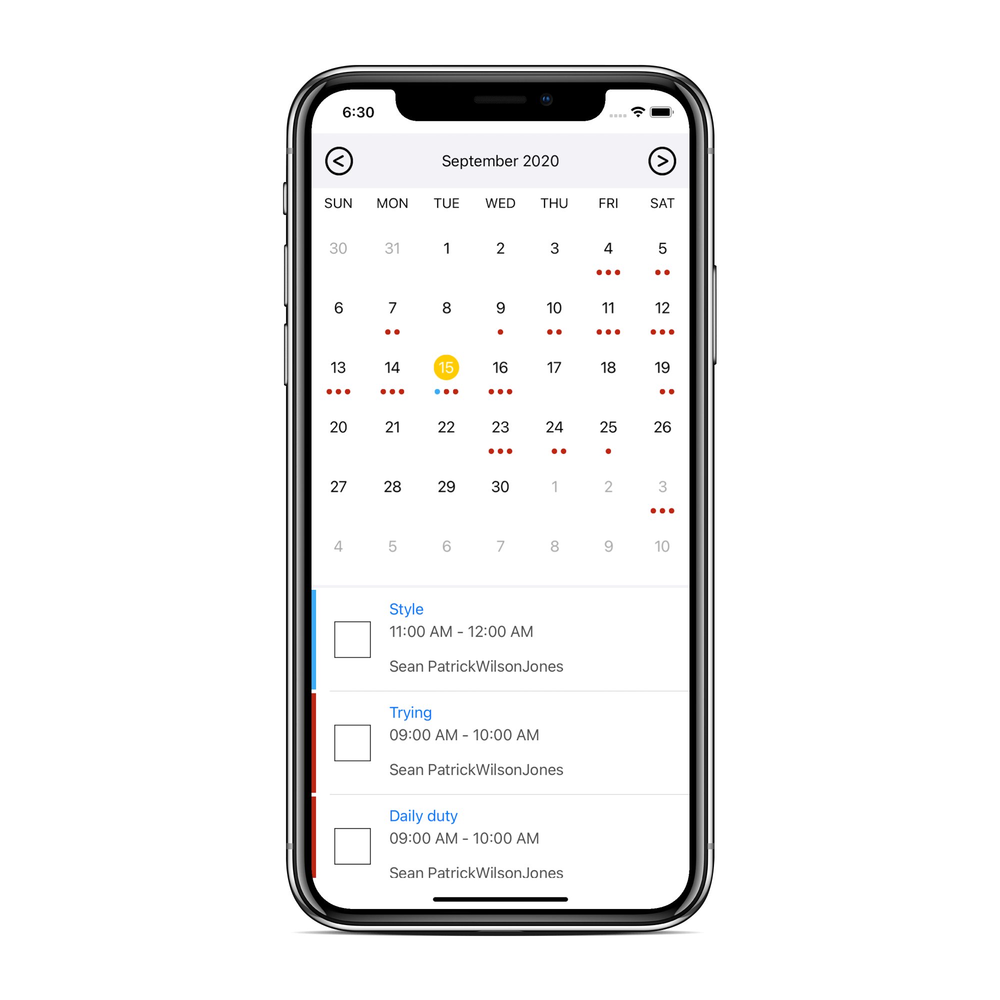

# JTAppleCalendar Customization

I this tutorial i'm just try to customize the JTAppleCalendar Library, For you
If you want exactly like this, Please give some time to this sample project.

# Languages / Frameworks Used
* Swift 5
* UIKit The project is built supporting iOS 13.6, you can change the deployment target to run it on previous iOS versions.

# How to run the project ?
* Download the zip file or clone the project, currently there's one master branch.
* Run the project using Xcode( change the bundle identifier, if you want to run it on your device).

# Having trouble ?
* If you are having trouble with this project or if you find any bugs, do open a new issue and describe the problem.
* Alternatively, you can drop me a mail @ rohitku.prajapati@gmail.com.

# Spread the word!
Liked the project? Just give it a star ⭐️ and spread the word!

# Credits
© Rohit Kumar | 2020
